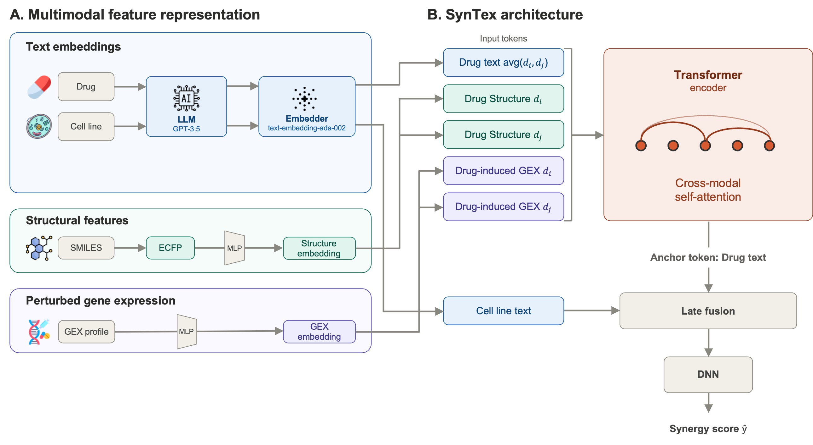

# SynTex: Leveraging Large Language Model Embeddings and Multimodal Integration for Drug Synergy Prediction

[](https://huggingface.co/juyeonk/SynTex)
[]()

## Overview

Identifying synergistic drug combinations is essential for effective cancer therapy but remains challenging due to complex biological interactions and combinatorial scale. We present **SynTex**, a transformer-based architecture for drug synergy prediction that integrates large language model (LLM)-derived text embeddings with molecular structure and drug-induced transcriptomic profiles through token-level cross-**modal** attention. Pretrained SynTex on the ZIP (Zero Interaction Potency) synergy score is available at [HuggingFace](https://huggingface.co/juyeonk/SynTex).

### Model Architecture



## Installation

### Requirements

- Python == 3.10
- torch == 2.1.2
- lightning == 2.2.0
- openai == 0.28.0
- numpy == 1.26.3
- pandas == 2.2.1
- pyyaml == 6.0.2
- setuptools < 82

### Setup

1. Clone the repository
```bash
git clone https://github.com/phjuyeon/SynTex.git
cd SynTex
```

2. Create a conda environment and install requirements
```bash
conda create --name syntex python=3.10
conda activate syntex
pip install -r requirements.txt
```

## Full Pipeline

### Step 1: Data Preparation

SynTex prepares multiple modalities for transformer-based fusion. This includes:
- drug and cell line text description generation
- text embedding generation from the descriptions
- loading other modality sources such as structure and perturbed gene expression

The descriptions are generated using OpenAI models and the prompts are provided in `prompts/`.

Set your Azure OpenAI credentials:

```bash
export AZURE_OPENAI_KEY=<your-key>
export AZURE_OPENAI_ENDPOINT=<your-endpoint>
```

Example input files are provided in the `data_example` folder and are read from  `data_example/{data}_{type}.csv` (e.g., `data_example/ONeil_drug.csv`):

```bash
python src/generate_descriptions.py --model <your-deployment-name> --data ONeil --type drug
python src/generate_descriptions.py --model <your-deployment-name> --data ONeil --type cell
```

Then generate text embeddings:

```bash
python src/get_embedding.py --filename generated_desc_drug.csv --type drug
python src/get_embedding.py --filename generated_desc_cell.csv --type cell
```

### Step 2: Cross-Validation (Feature Ablation)

| Flag | Modality |
|------|----------|
| `--t` | drug LLM text |
| `--s` | drug structure (ECFP) |
| `--p` | drug-induced (perturbed) gene expression |
| `--c` | cell line LLM text |
| `--g` | baseline gene expression |

**Note:** Not all features are available for all datasets. The examples below show the supported feature combinations for each dataset.

```bash
python src/cross_validation.py --data ONeil --t --c
python src/cross_validation.py --data DrugComb --t --s --p --c
python src/cross_validation.py --data GDSC2 --t --s --c --g
```

### Step 3: Pretrain SynTex on DrugComb

```bash
python src/pretrain.py
```

You can also pretrain SynTex on your data.

### Step 4: Zero-Shot Learning on UTSW

Our pretrained model `model.pt` is available from [HuggingFace](https://huggingface.co/juyeonk/SynTex). Then run:

```bash
python src/zero_shot.py
```

## Citation

TBD